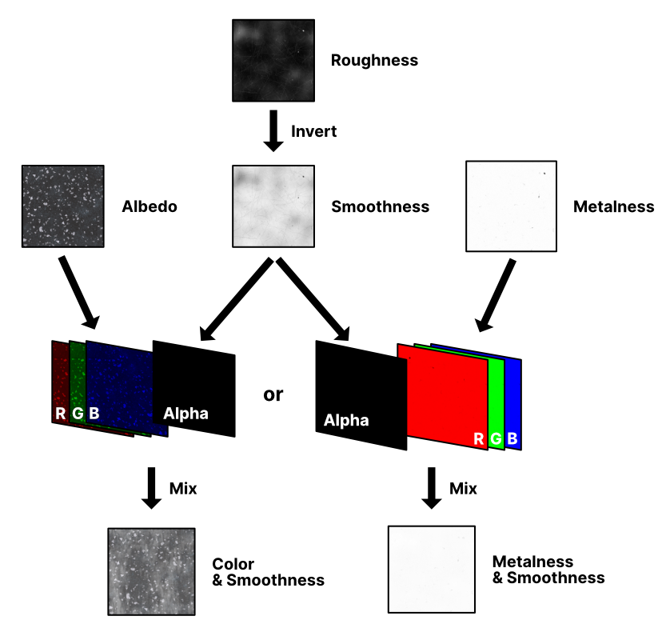

# 🖌️ Rough2Alpha

A quite simple Python script that automates a task that can be useful when working with PBR textures (used for realistic rendering in video games, architecture, movies, etc).

## When is it useful ?

When you can't re-export a PBR texture especially for the workflow needed by the shaders of the game engine you're using. This is a quite common case when you download "as is" a PBR texture that has been already exported as a predefined set of image files, and then you definitely can't re-export it as you'd want.

For example, Unity and its PBR materials (no matter [Standard](https://docs.unity3d.com/Manual/StandardShaderMaterialParameters.html), [HDRP](https://docs.unity3d.com/Packages/com.unity.render-pipelines.high-definition@10.1/manual/Lit-Shader.html#surface-inputs) or [URP](https://docs.unity3d.com/Packages/com.unity.render-pipelines.universal@10.1/manual/lit-shader.html#surface-inputs)) prefer to have a **Smoothness** texture (which is the opposite of a **Roughness** texture) inside the alpha channel of either the **Albedo** or the **Metallic** textures.

Unreal Engine 4, for its [PBR materials](https://docs.unrealengine.com/en-US/Engine/Rendering/Materials/PhysicallyBased/index.html#materialparameters), prefer to have a **Roughness** texture.

So, if you're willing to use in Unity a PBR texture that have its **Rougness** as a separate file, then this script would be useful.

## What is it doing ?

It takes a **Roughness** texture, inverts its color to obtain a **Smoothness** texture, and injects it as the alpha channel of either an **Albedo** or a **Metallic** texture (it depends on what you have).

Here it is explained with a beautiful chart.



Textures shown in the chart are courtesy of [CC0 Textures](https://cc0textures.com/).

# 🤔 Why ?

I couldn't find a easy way to do this and got pissed off enough to finally do it myself.

# ⚙️ Installation

- Clone the git repository or download and extract it somewhere.
- Install Pillow. You can try with `pip install -r requirements.txt` but if it doesn't work, take a look at the [Pillow website](https://pillow.readthedocs.io/en/stable/installation.html).

Tested on :
- Python 3.7.3 - Ubuntu 18.04.1 LTS on Windows 10 (WSL1)
- Python 3.7.3 - Windows 10 (1909)

# ⌨️ Usage

This can be used as a standalone script or as a Python module.

It may take a few seconds to complete when using it on high resolution textures (which is being common in video games using PBR textures)

## Standalone usage

If you have a **Roughness** texture that you wish to insert as the alpha channel of a **Metalness** texture :

```console
$ python rough2alpha.py Metal003_2K_Roughness.jpg Metal003_2K_Metalness.jpg
```

If you have a **Roughness** texture that you wish to insert as the alpha channel of an **Albedo** (Color) texture :


```console
python rough2alpha.py Terrazo003_2K_Roughness.jpg Terrazo003_2K_Color.jpg
```

Also, you can customize the filename of the generated texture by passing a `suffix` argument.

```console
$ python rough2alpha.py --suffix Unity Metal003_2K_Roughness.jpg Metal003_2K_Metalness.jpg
```

## Module usage

Looks pretty much like its usage as a standalone script. The optional `suffix` argument is now a keyword argument.

```python
import rough2alpha

rough2alpha.convert('Metal003_2K_Roughness.jpg', 'Metal003_2K_Metalness.jpg', suffix='Unity')
```

# 🌌 Misc

The code is made available under the [MIT license](https://tldrlegal.com/license/mit-license).

For your knowledge, here are some useful links about PBR and its workflows :

- [PBR Texture Conversion](https://marmoset.co/posts/pbr-texture-conversion/), Marmoset
- [The Differences Between Metalness and Specular Workflows](https://help.poliigon.com/en/articles/1712659-the-differences-between-metalness-and-specular-workflows), Poliigon
